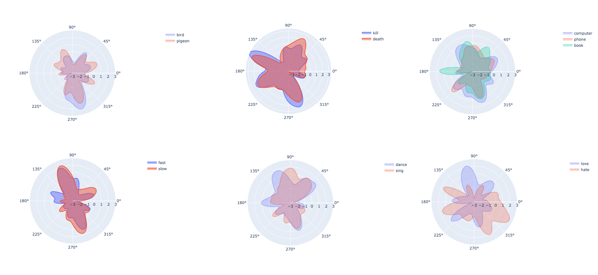
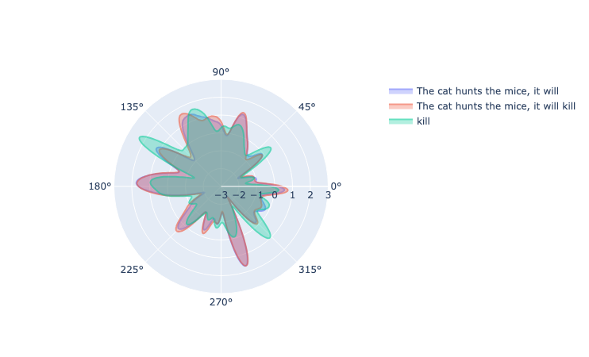
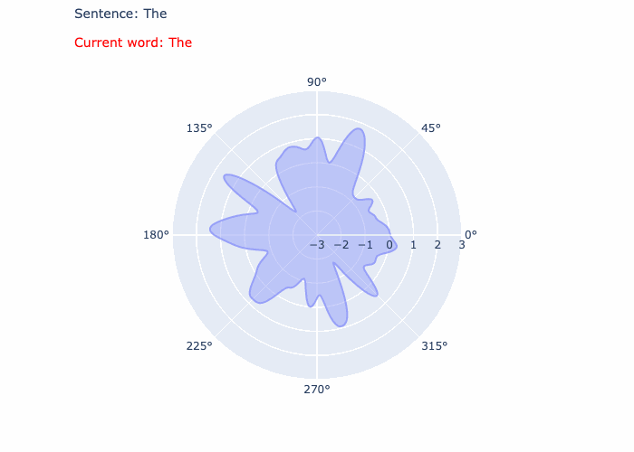
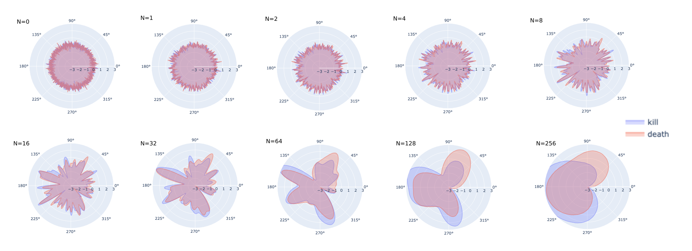

# 🕸 embeddings-radar-chart 🕸

## 🎯 Project Overview

This project aims to represent word embeddings, particularly the BERT embeddings, which consist of 768 dimensions. The challenge was to represent these embeddings in a readable manner without compromising on the number of dimensions displayed.

To achieve this, words were plotted in a radar chart (or spider chart), where the goal was to find an order to arange dimensions that maximises the correlation between dimensions that are closed to each other, ensuring a clearer representation.

## 🚀 Approach

1. **Problem Complexity**: This problem is NP-Complete (this is the Travelling Salesman Problem), I opted for a genetic algorithm.
2. **Algorithm Strategy**: The genetic algorithm aimed to position each dimension next to its most correlated counterpart and oppose the least correlated ones. It reached a plateau after 250 generations.
3. **Dimension Analysis and Treament**: The correlations between the dimensions were low, with the majority of absolute correlation values lying between 0.3 and 0.4. To standardize and provide a uniform scale for these dimensions, each dimension was first centered by subtracting the mean and then scaled by dividing it by the standard deviation. Given that the direction of correlation (positive or negative) could lead to ambiguity in visual interpretation, the analysis solely concentrated on the absolute values of these correlations, ensuring clarity and straightforwardness in subsequent visualizations. 
4. **Gaussian Filter Application**: Given the low correlation values, the visualizations didn't appear as expected. The order found made the radar charts slightly less randomized but not fully coherent. To enhance the visualization, a Gaussian filter was applied to smoothen the curve, yielding much clearer results.

## 🧐 Results Interpretation

Although we occasionally observe striking overlaps for words with close semantic meanings, the outcomes are mixed and raise questions about their interpretation. First, it's challenging to draw definitive conclusions from these representations—they don't always provide a clear understanding of the semantic relationships between words. Furthermore, words intuitively perceived as similar may turn out to have surprisingly distant representations, and conversely, words that seem different may display unexpected proximity in the radar charts. Additionally, the approach of grouping dimensions using a Gaussian filter adds an element of mystery: it's not clear what precise transformations or underlying relationships are emerging from this process. 


## 🎨 Visualization

You can see the outcomes of this approach in the following images and GIFs:
- Proximity and differences between word embeddings



- A sentence compared to itself + one word compare to that word



- Evolution of sentence embeddings, word by word



- Evolution of the shape in function of the gaussian size




## 🔧 Getting Started

The entire project is encapsulated in a notebook. All required dependencies are specified in it.

For a smooth experience:
1. Clone the repository.

```bash
git clone git@github.com:Naowak/embeddings-radar-chart.git
```

2. Do not hesitate to use a virtual env, but add it to your jupyter notebook.

```bash
python -m venv venv
source venv/bin/activate
python -m pip install ipykernel
python -m ipykernel install --user --name=embeddings-radar-chart
```

## 💡 Contribution & Feedback

Feel free to fork, raise issues or provide feedback. Your insights could further enhance the visualization and understanding of embeddings!

